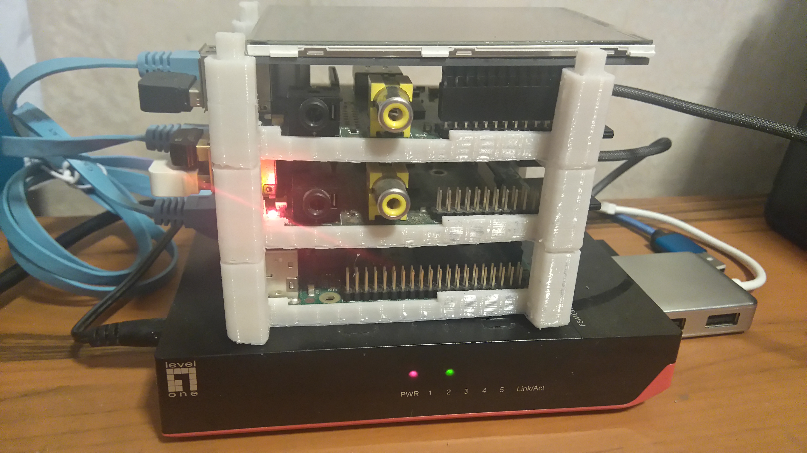
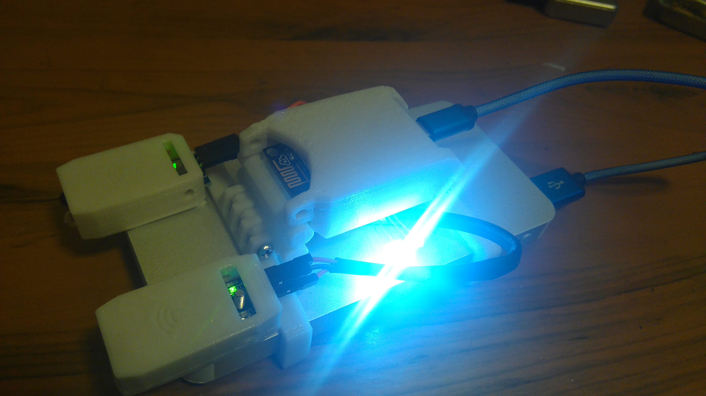
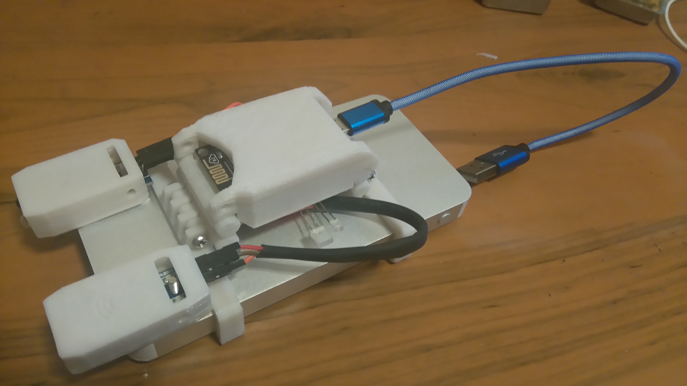
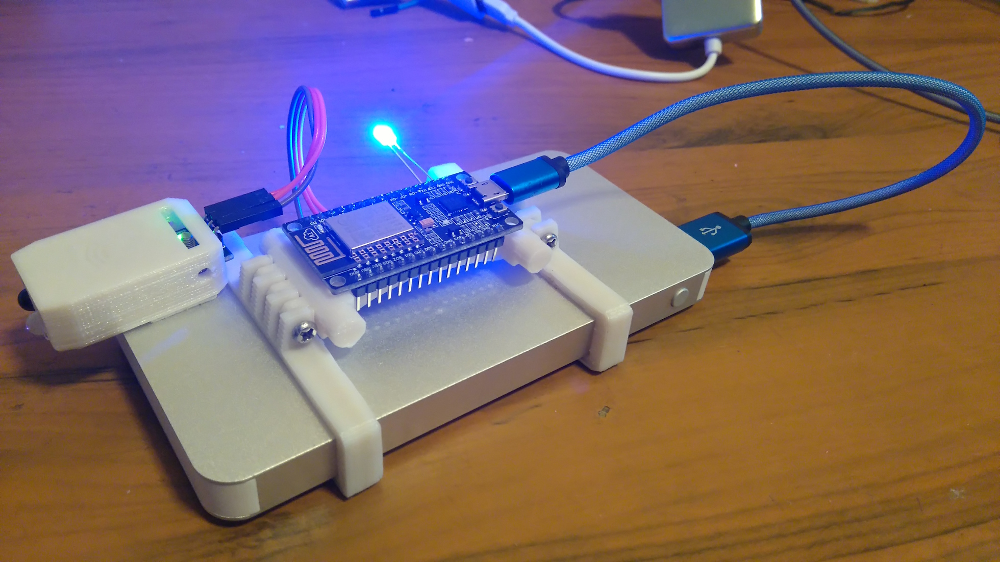
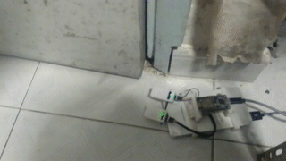
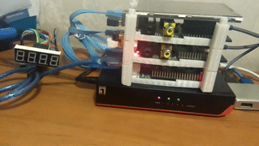

Simple IoT System
===

```
The Internet of Things (IoT) is the network of physical objects—devices, vehicles, 
buildings and other items—embedded with electronics, software, sensors, 
and network connectivity that enables these objects to collect and exchange data.
```
 -- Wikipedia https://en.wikipedia.org/wiki/Internet_of_Things

Here presents a simple IoT system, designated for checking the frequency of your door secretly opened/closed. In simple words, room passagers counter.

Thanks todays advanced technologies and admirable human imagination, this example project attempts to apply the following technologies/devices:
* Raspberry Pi https://www.raspberrypi.org/ , as MQTT server/client and DNS server.
* Arduino https://www.arduino.cc/ , for controlling low end periherials
* NodeMcu http://nodemcu.com/index_en.html , as IoT sensors with lua programming language support
* MQTT http://mqtt.org/, as an ideal IoT networking protocol 
* Redis http://redis.io/, as a messaging service provider
* Printrbot https://printrbot.com/ , as a 3D printer for boxes/frames of the sensors/RPi
* Sketchup http://www.sketchup.com/ and Cura https://ultimaker.com/en/products/cura-software, for 3D modeling and printing

Snapshot
---


(a raspberry pi stack, .stl files for the frame by wgbartley can be found on http://www.thingiverse.com/thing:1289829)




3D printed framework mounted on a power bank to create a platform supporting nodemcu and IR sensors.

Brief Network Architecture
---


(draw on https://www.draw.io/)

There is a nodemcu wireless device, powered by a power bank, with infrared sensors, connected to a WIFI router in a network with RPi server. The RPi server also connects to a hub and creates another network with a another RPi client. There is also a arduino driven number display connected to the RPi client and constantly blinks an increment of value as counter.

### OK, Someone opens/closes the door ...
Whenever a passager passes through your door, the IR sensors trigger signals to nodemcu which then broadcasts MQTT message to the "cloud".




[init.lua](init.lua)
```lua
...

isd1 , isdetected = checkDetect(DETECTPIN,isdetected)
isd2 , isdetected2 = checkDetect(DETECTPIN2, isdetected2)
if isd1 or isd2 then
    mqttSendMsg(cjson.encode({pinstate1=isdetected,pinstate2=isdetected2}))
end

...
```

The payload of the MQTT message is in [JSON](https://en.wikipedia.org/wiki/JSON) format, states the situation of two trigger pins. 

### MQTT server receives the signals ...
The RPi MQTT server listens on default port 1883 and waits for some entities to pick up this message.
Installation and execution a MQTT server on linux is rather simple.
```sh
apt-get install mosquitto
mosquitto
```

Please note that the network configuration is setup by dnsmasq. Interested parties may look at this [tutorial](https://www.linux.com/learn/dnsmasq-easy-lan-name-services) .

### MQTT subscriber listens the signals from server ...

[backend/nodelisten.py](backend/nodelisten.py)
```python
def on_message(client, data, msg):
	if str(msg.topic) == MQTT_TOPIC:
		print(msg.topic+" "+str(msg.payload))
		r.publish(RQUEUE_NUMADD,'')
		
...

client.on_message = on_message

client.connect(MQTT_CONNECT_HOST,MQTT_CONNECT_PORT,60)

...
```
When this MQTT subscriber receives the signals (the JSON data), it is supposed to notify the arduino driven display to display a counter value. However, if the door opens/closes very quickly and frequenctly, that would be ungraceful to have a chance to jam the serial port. 

Therefore, it is nice to have a queuing system to process this signals as a time buffer to avoid such case. Notices that the r variable in the above code is a redis client connected to local redis server, the purpose of this is to call this service and have other workers to complete the service (notify the arduino).

### Redis subscriber receives call of service ...
The Redis subscriber listens to local Redis server and works on some functions depends on what channel of querying message belongs to be. In this case, it needs a service to notify the ardunio to increase counter value by one and blink the display for every querying message.

[backend/displaylisten.py](backend/displaylisten.py)
```python
if message is not None and message['type'] == 'message':
			mdata = message['data']
			mchan = message['channel']
			if mchan == RQUEUE_NUMDISP:
				if mdata is not None and len(mdata) > 0 and mdata.isdigit():
					DisplayNumber(ser,mdata,2)
			if mchan == RQUEUE_NUMADD:
				currentnum = DisplayNumber(ser,'+',1)
				if currentnum is not None and mdata is not None and len(mdata) > 0:
					print('resp '+mdata+' '+str(currentnum))
					r.set(RQUEUE_RESP_PREFIX+mdata,currentnum)
```
The communication between Rpi and arduino is via a serial port (or [uart](https://en.wikipedia.org/wiki/Universal_asynchronous_receiver/transmitter)).

### Finally, ardunio displays the counter value on screen...
The arduino UNO accepts commands from RPi and does the blinking accordingly on a 4-digit 7-segment display. A nice tutorial on pins configuration and implementation can be found on [this](http://www.hobbytronics.co.uk/arduino-4digit-7segment).



Hardware Part
---

Hardware in this project includes nodemcu and arduino UNO mainly, while RPi uses only USB port like a computer.

### about IR sensors


The above image shows sensor similar to the IR sensors used in the project

The IR sensors operates by outputing high logic level voltage when IR signals reflect back to itself indicating something is blocking.

### pins assignment of nodemcu

Two pins are required for detecting IR sensors and thus configured as input [GPIOs](https://en.wikipedia.org/wiki/General-purpose_input/output)

An output pin is for blinking LED.

The following shows the pins definitions on nodemcu (mcu is ESP8266)
|function|pin code| |Pin code|function|
|:---|:---|:---|:---|:---|
||A0||D0||
||RSV||D1|blinking LED pin|
||RSV||D2|Detect pin 1|
||SD3||D3|Detect pin 2|
||SD2||D4|default LED|
||SD1||3V3||
||CMD||GND||
||SD0||~D5||
||CLK||~D6||
||GND||~D7||
||3V3||~D8||
||EN||Rx||
||RST||Tx||
||GND||GND|common ground|
||VIN||3V3|power supply to IR sensors|


Please note that some power bank may terminate power if discharge current is very small (as a protection to avoid overcharge/fire). So LEDs can be added so that it draws larger current to avoid such case.

### pins assignment of arduino UNO

Official website shows the pins mapping for arduino UNO (https://www.arduino.cc/en/Hacking/PinMapping168).

The 4-digit 7-segment display requires 12 pins for full control.
```c
int digit1 = 13; //PWM Display pin 1
int digit2 = 10; //PWM Display pin 2
int digit3 = 9; //PWM Display pin 6
int digit4 = 7; //PWM Display pin 8

//Pin mapping from Arduino to the ATmega DIP28 if you need it
//http://www.arduino.cc/en/Hacking/PinMapping
int segA = 12; //Display pin 14
int segB = 8; //Display pin 16
int segC = A0; //Display pin 13
int segD = 3; //Display pin 3
int segE = 2; //Display pin 5
int segF = 11; //Display pin 11
int segG = 6; //Display pin 15
```

